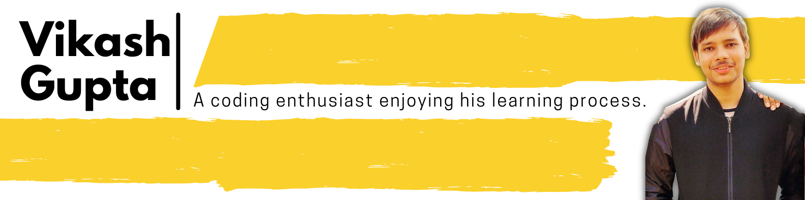

<h1 align="center">Hey,नमस्ते (Namaste)🙏🏻, I'm Vikash Gupta!</h2>

 

- <i>Currently:</i> A CS student at **Jain University**, Bangalore.

<h2>💻 I'm Currently Learning</h2>

**A self learner**

- Web Development
- Data Structure and Algorithms

<h2>👨‍💻Currently working on:</h2>

<h3>Web Development -</h3>

I have document my experience throughout this process, and you can find them on my [LinkedIn featured](https://www.linkedin.com/in/heyimvikash/).

## 🕶 Check out my GitHub repository:

<h2>👀 GitHub Stats</h2>

<h2>A little more about me...⚡:</h2>

Hello there,
I'm a 19-year-old boy and I love writing code.
I am passionately engaged in learning DsAlgo (Data Structures and Algorithms) and simultaneously developing my problem-solving skills on go. This [Repository](https://github.com/heyimvikash/DataStructures-And-Algorithms) will be containing my resources, tutorial, codes, and my approach to Qs, for future reference. As I'm in the learning process, [this repository](https://github.com/heyimvikash/DataStructures-And-Algorithms) will be refreshed daily with my new bits of knowledge..

I think implementing my learnings into real-world projects is the best way to move forward in my path and beauty computer science had made it easy for me where I can implement whatever I learn at the ease of my room and boost the confidence of my knowledge exponentially so on this note I started web-development and build 21-23 practice-projects like the different Landing pages, note-taking website, menu-filtering website. You can find few of them on [LinkedIn featured](https://www.linkedin.com/in/heyimvikash/) and do experience a live website [here](https://heyimvikashdirectory.netlify.app/), a web application for taking down the grocery lists.

Whenever I self-learn about any technology then sharing it with you all guys become my necessity.
If you have learned any new technology and want to share your joy, your struggling part, and your behind story while learning it, with someone, then I'm the right guy, ready to learn from your experiences, do reach out.

<h2>Say me "Hi" on 💬</h2>

  

<!--
**laxmena/laxmena** is a ✨ _special_ ✨ repository because its `README.md` (this file) appears on your GitHub profile.

Here are some ideas to get you started:

- 🔭 I’m currently working on ...
- 🌱 I’m currently learning ...
- 👯 I’m looking to collaborate on ...
- 🤔 I’m looking for help with ...
-  Ask me about ...
- 📫 How to reach me: ...
- 😄 Pronouns: ...
- ⚡ Fun fact: ...
-->
